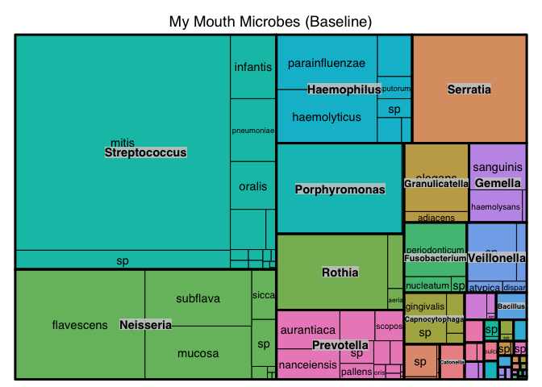
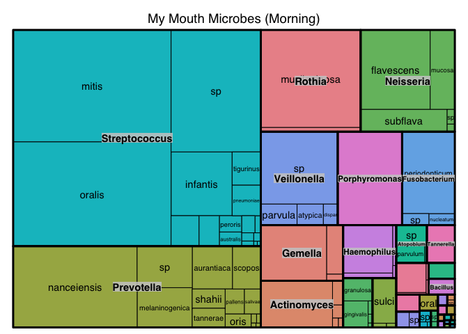
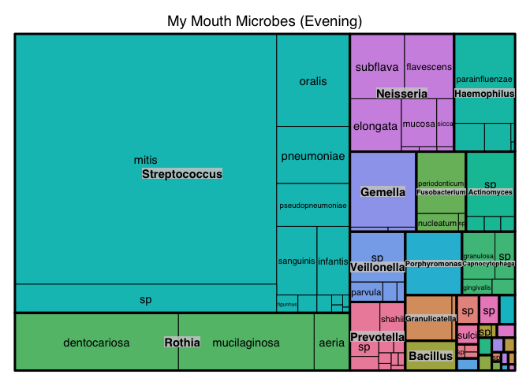
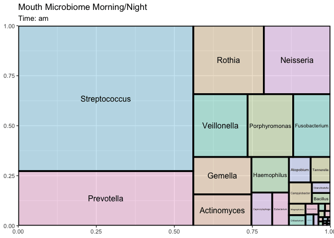

Morning vs Night
================
Richard Sprague
9/26/2022

What happens to my mouth microbiome throughout the day?

## Baseline

This sample was taken in June on a random, typical morning first thing
after waking.

``` r
baseline_sample <- bristler::read_bristle_table(filepath=file.path("data", "BristleHealthRaw.xlsx"))

baseline_sample %>% treemap::treemap(dtf=., index = c("genus","species"),
                 vSize="abundance",
                 type = "categorical",
                 vColor = "genus",
                 position.legend = "none",
                 title = "My Mouth Microbes (Baseline)")
```

<!-- -->

## Morning

After collecting my baseline in June, I ordered more kits and tested
myself again in August, this time twice on the same day. How much does
the microbiome shift?

This sample was collected a few minutes after waking up. I usually wear
an orthodontic retainer, so this is my oral microbiome *with* the
retainer.

``` r
am_sample <- bristler::read_bristle_table(filepath=file.path("data", "Bristle-2022-08-02-AM.xlsx"))


am_sample %>% 
treemap::treemap(dtf=., index = c("genus","species"),
                 vSize="abundance",
                 type = "categorical",
                 vColor = "genus",
                 position.legend = "none",
                 title = "My Mouth Microbes (Morning)")
```

<!-- -->

## Evening

I went the rest of the day as normal. This sample was collected at 10pm,
about three hours after my last meal, and before inserting the retainer
or brushing my teeth.

``` r
pm_sample <- bristler::read_bristle_table(filepath=file.path("data", "Bristle-2022-08-02-PM.xlsx"))

pm_sample %>% 
treemap::treemap(dtf=., index = c("genus","species"),
                 vSize="abundance",
                 type = "categorical",
                 vColor = "genus",
                 position.legend = "none",
                 title = "My Mouth Microbes (Evening)")
```

<!-- -->

## Animated Version

``` r
library(gganimate)

day_samples <- bristler::combine_bristle_table(am_sample,pm_sample,"am","pm")
s1 <- day_samples %>% filter(label=="am") %>% bristler::treemap_of_sample() %>% mutate(label = "am")
s2 <- day_samples %>% filter(label=="pm") %>% bristler::treemap_of_sample() %>% mutate(label = "pm")
```

<!-- -->

``` r
s <- rbind(s1,s2)
```

``` r
sanim <- s %>%  group_by(label) %>%
  ggplot(aes(xmin = x0, ymin = y0, xmax = x1, ymax = y1, mysample=label)) +
  # add fill and borders for groups and subgroups
  geom_rect(aes(fill = color, size = primary_group),
            show.legend = FALSE, color = "black", alpha = .3) +
  scale_fill_identity() +
  # set thicker lines for group borders
  scale_size(range = range(s$primary_group)) +
  ggfittext::geom_fit_text(aes(label=genus), min.size = 1) +
    scale_x_continuous(expand = c(0, 0)) +
  scale_y_continuous(expand = c(0, 0)) +  
  labs(title = "Mouth Microbiome Morning/Night",
       # subtitle = "Number of days: {filter(.data, my_tm == current_frame) %>% pull(sample) %>% .[[1]]}") +
       subtitle = "Time: {closest_state}") +
  
   gganimate::transition_states(label) #, state_length = .2, transition_length = .40) 
  

gganimate::animate(plot=sanim, end_pause = 5, detail = 20, fps=12, duration = 3)
```

<!-- -->
