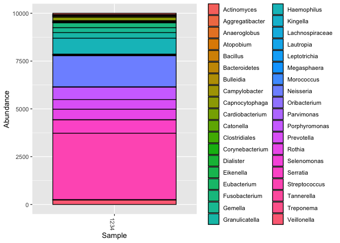
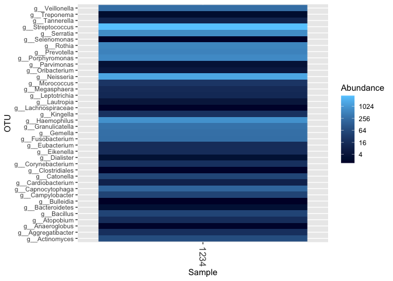
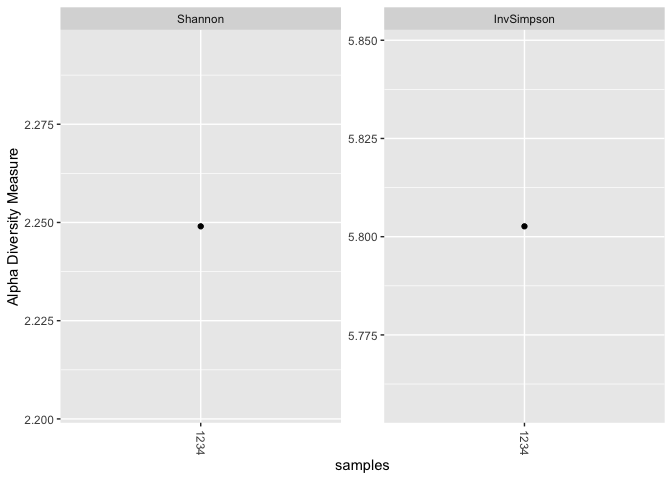
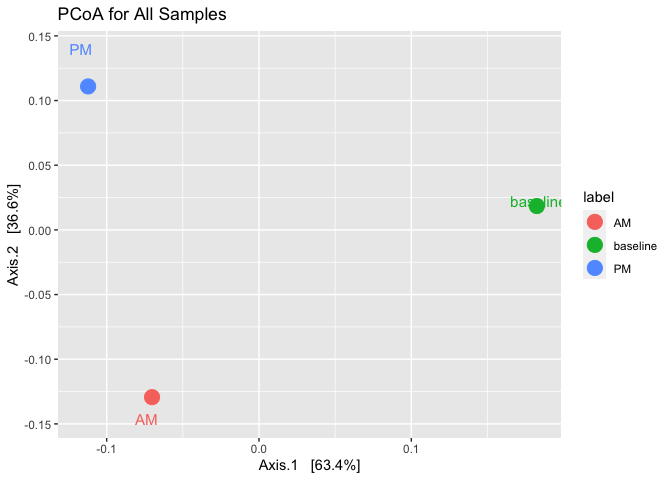

Bristle and Phyloseq
================
Richard Sprague
2022-09-20

## Introduction

Phyloseq is an open source microbiome manipulation package in the
BioConductor toolkit for R[^1]. Introduced in 2013[^2], it turns your
microbiome data into an object-oriented representation that can be
easily imported or exported to other common formats, and it supports
many analysis techniques including calibration, filtering, subsetting,
agglomeration, multi-table comparisons, diversity analysis, parallelized
Fast UniFrac, ordination methods, and production of publication-quality
graphics.

The combination of R, with RStudio, and Phyloseq is a powerful
environment for microbiome investigation. Providing easy, interactive
access to nearly every state-of-the-art algorithm in statistics, machine
and deep learning, it can let you study your data quickly and
iteratively, with exceptional plotting features that set the standard
for publication-quality work.

This example uses the package `bristler` to read Bristle raw data and
convert it to a Phyloseq object. Once the data is encapsulated in
Phyloseq, you have access to hundreds of additional microbiome data
manipulation and analysis functions.

## Read Bristle sample data

``` r
bristle_data <-bristler::read_bristle_table(filepath=file.path("data/BristleHealthRaw.xlsx"))
```

## Create a mapfile

Experiment dataframe with the following exact column names (additional
columns are okay but will be ignored):

- “ssr”: sequencing revision, aka sample ID number (e.g. 42578). Your
  column probably repeats many SSRs.

- “tax_name”: (e.g. “Streptococcus”).

- Mapping file: a dataframe that contains: “ssr”: exact same SSRs as
  experiment dataframe above attributes columns: as many as you like.
  (e.g. “dentist_before”, “geo”, “kefireater”, “gender”)

``` r
bristle_data$ssr <- 1234
mapfile <- tibble(ssr=1234,label="baseline")
```

## Make the Phyloseq object

``` r
e.ps <- bristler::phyloseqize(bristle_data, mapfile = mapfile)
```

``` r
plot_bar(e.ps, fill = "Genus")
```

<!-- -->

``` r
plot_heatmap(e.ps, method = "CCA", distance = "none",fill = "Genus")
```

<!-- -->

Now try other Phyloseq operations. Here’s how to calculate diversity.
You can choose any of the Phyloseq diversity metrics and plot the
results.

``` r
estimate_richness(e.ps, measures = c("InvSimpson","Shannon"))
```

    ##    Shannon InvSimpson
    ## 1 2.249027   5.802677

``` r
plot_richness(e.ps, measures = c("InvSimpson","Shannon"))
```

<!-- -->

## Additional objects

Create more Bristle objects and then merge them with `merge_phyloseq()`

``` r
am_sample <- bristler::read_bristle_table(filepath=file.path("data", "Bristle-2022-08-02-AM.xlsx"))
am_sample$ssr <- 1235
am_mapfile <- tibble(ssr=1235,label="AM")

am.ps <- bristler::phyloseqize(am_sample,am_mapfile)


  
pm_sample <- bristler::read_bristle_table(filepath=file.path("data", "Bristle-2022-08-02-PM.xlsx"))
pm_sample$ssr <- 1236
pm_mapfile <- tibble(ssr=1236,label="PM")

pm.ps <- bristler::phyloseqize(pm_sample, pm_mapfile)

all_samples <- phyloseq::merge_phyloseq(e.ps, am.ps, pm.ps)
```

## Special Taxa

Here are taxa that were found in the morning but not in the evening:

``` r
psmr::unique_taxa(am.ps, pm.ps) %>% 
  knitr::kable(row.names=FALSE,
               digits = 2,
               col.names = c("Abundance (%)", "Tax Name"))
```

| Abundance (%) | Tax Name                |
|--------------:|:------------------------|
|         30.37 | g\_\_Megasphaera        |
|          7.76 | g\_\_Centipeda          |
|          6.22 | g\_\_Parvimonas         |
|          3.04 | g\_\_Dialister          |
|          1.55 | g\_\_Solobacterium      |
|          1.55 | g\_\_Propionibacterium  |
|          1.51 | g\_\_Peptostreptococcus |
|          1.20 | g\_\_Bifidobacterium    |

## Ordination

This is a statistical method that can help identify unusual aspects of
the data. It is especially useful for generating plots that show
similarity among items.

``` r
all_samples.ord <- phyloseq::ordinate(all_samples, method = "PCoA")
phyloseq::plot_ordination(all_samples, all_samples.ord,
                          title = "PCoA for All Samples",
                          color = "label",
                          label = NULL) +
    geom_point(size = 5)  +  # add alpha=0.4 if you like
    geom_text(aes(label=label),size = 4, position = position_jitter()) #hjust = "left", vjust = "inward" )
```

<!-- -->

## Summary

Once you’ve built a Phyloseq object, you can use the entire power of
Phyloseq. See the [Phyloseq
Vignettes](https://bioconductor.org/packages/release/bioc/vignettes/phyloseq/inst/doc/phyloseq-analysis.html)
for plenty of examples.

Note that there are several limitations, because currently the Phyloseq
object is created from the limited data presented on the Bristle web
site. Most importantly, your object will only have genus and species
information. Partly because of this, there is no taxonomy tree
information either, which limits some important functionality, notably
the ability to do Unifrac. But most of the other functionality is there,
so play away!

[^1]: Read this beginner’s guide:
    <http://joey711.github.io/phyloseq-demo/phyloseq-demo.html>

[^2]: McMurdie, Paul J., and Susan Holmes. “Phyloseq: An R Package for
    Reproducible Interactive Analysis and Graphics of Microbiome Census
    Data.” Edited by Michael Watson. PLoS ONE 8, no. 4 (April 22, 2013):
    e61217.
    [doi:10.1371/journal.pone.0061217](http://journals.plos.org/plosone/article?id=10.1371/journal.pone.0061217).
