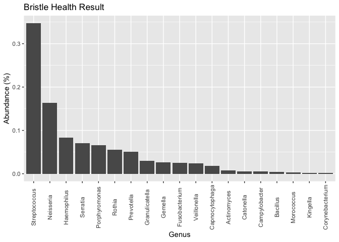
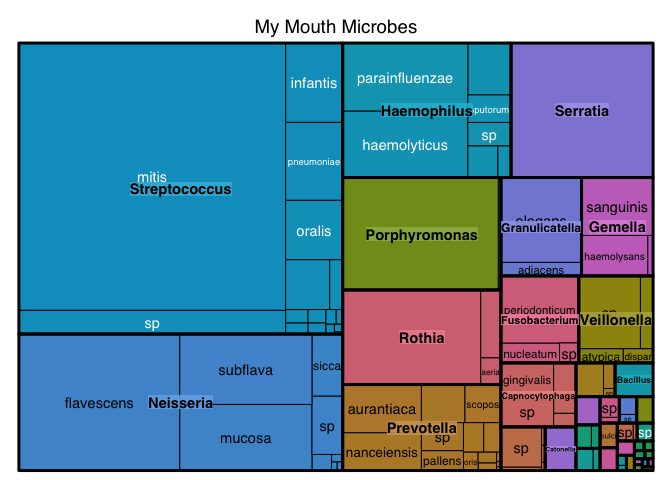
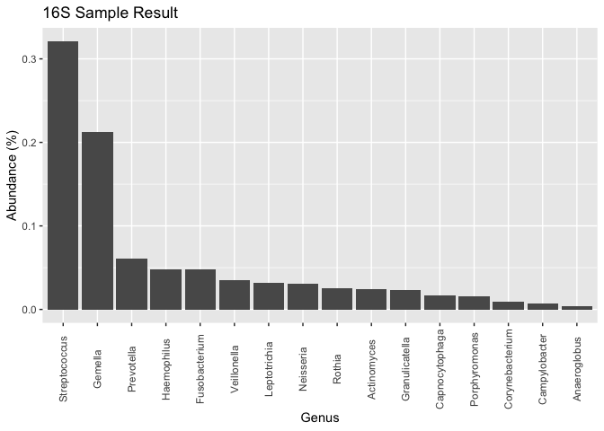
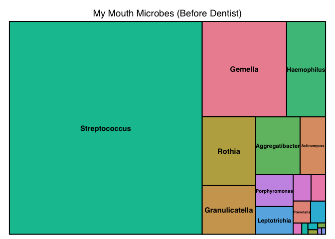
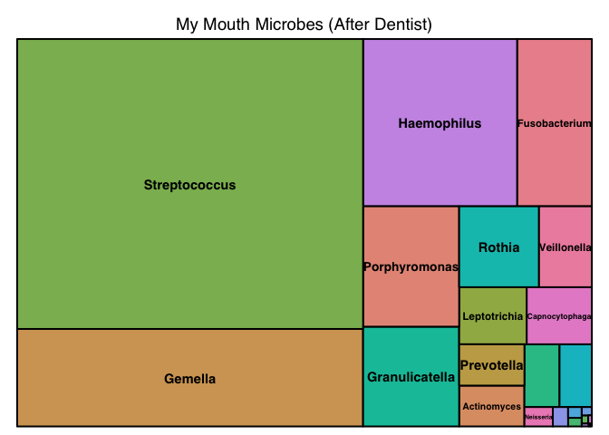

Read Bristle Health Raw Data
================
Richard Sprague
9/20/2022

The oral microbiome testing company, Bristle Health, gives me a web page
table of all the microbes they found in my mouth. Can I turn that web
page table into a more useful R dataframe?

## Read the Data

The data is kept in a format with columns for `genus`, `species`, and
`relative abundance`. That’s easy to read straight from Excel format.

``` r
if(!require("bristler")) devtools::install_github("personalscience/bristler")
library(tidyverse)


raw_bristle_data <-bristler::read_bristle_table(filepath=file.path("data/BristleHealthRaw.xlsx"))

raw_bristle_data %>% bristler::plot_bristle_freq()
```

<!-- -->

## Make a Tree Map

``` r
if(!require("treemap")) install.packages("treemap")

raw_bristle_data %>% 
treemap::treemap(dtf=., index = c("genus","species"),
                 vSize="abundance",
                 title = "My Mouth Microbes")
```

<!-- -->

## 16S Samples

Make a dataframe of all uBiome samples (genus level only). Requires
[some special packages](https://github.com/richardsprague/actino).

``` r
library(actino)
library(phyloseq)
library(psmr)  # use library function instead.

options(scipen = 999)

mouth.genus <- subset_samples(sprague.genus.norm, Site == "mouth")

mouth_df <- mhg_df_just_taxa(mouth.genus,"Streptococcus") %>% select(Date,Label,abundance)

bristle_genus <- raw_bristle_data %>% select(genus) %>% pull(genus) %>% unique()

ub_labels <- mhg_df_just_taxa(mouth.genus,"Streptococcus") %>% pull(Label)

ub_mouth_genus_df_abundances <- sapply(bristle_genus[c(1:16,18:31,34,37)],function(x) {mhg_df_just_taxa(mouth.genus,x) %>% pull(abundance)/1000000}) %>% as.data.frame()

ub_mouth_genus_df <- cbind(ub_labels,ub_mouth_genus_df_abundances)
```

## Plot 16S Data

``` r
ub_mouth_genus_of_sample <- function(sample_number = 1, genus_df=ub_mouth_genus_df) {
  .rownames <- genus_df[sample_number,-1] %>% t() %>% as.data.frame() %>% rownames() 
  return(tibble(genus = .rownames,abundance = genus_df[sample_number,-1] %>% t() %>% as.vector() ))
}

ub_mouth_genus_of_sample(1)  %>% 
  slice_max(order_by=abundance, prop=.5) %>% # summarize(total=sum(sum))# %>% 
  ggplot(aes(x=reorder(genus,-abundance), y=abundance)) + geom_col() + 
  theme(axis.text.x=element_text(angle = 90, vjust = 0.5)) +
  labs(y="Abundance (%)", x = "Genus", title = "16S Sample Result")
```

<!-- -->

## Tree Map of 16S Data

``` r
ub_mouth_genus_of_sample(75) %>% 
treemap::treemap(dtf=., index = c("genus"),
                 vSize="abundance",
                 title = "My Mouth Microbes (Before Dentist)")
```

<!-- -->

``` r
ub_mouth_genus_of_sample(76) %>% 
treemap::treemap(dtf=., index = c("genus"),
                 vSize="abundance",
                 title = "My Mouth Microbes (After Dentist)")
```

<!-- -->
